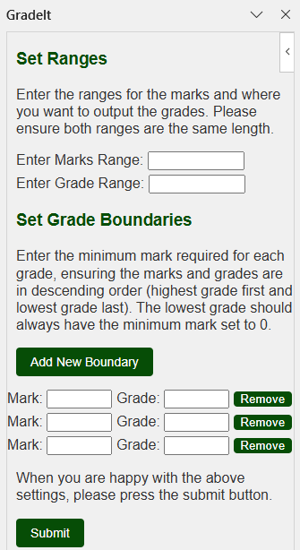

# GradeIt

GradeIt is an Excel Add-in to assist with assigning grades to student marks. Set the cell ranges for marks and grades, assign grade boundaries, and let the GradeIt do the work for you.

## Features
- Calculate Student Grades Quickly
- User Friendly Interface
- Works on Windows, Mac, iPad, and Web (Chrome and Edge browsers only)

## User Guide
- Open the Excel sheet with student marks you want graded. Marks should be in a single column.
- Open the GradeIt Add-In via the Home tab.
- Enter the column ranges for student marks and where you want grades to be output (for example B2:B10)
- Assign Grades and the Mark requirements for them.
- Press Submit and grades will be assigned to the column you chose.
- If an error occurs, then a message explaining the problem will appear below the sumit button.
\
\

## Technical Info
- Written with Javascript, HTML, and CSS
- Uses node.js and Yeoman Generator for Office Add-ins